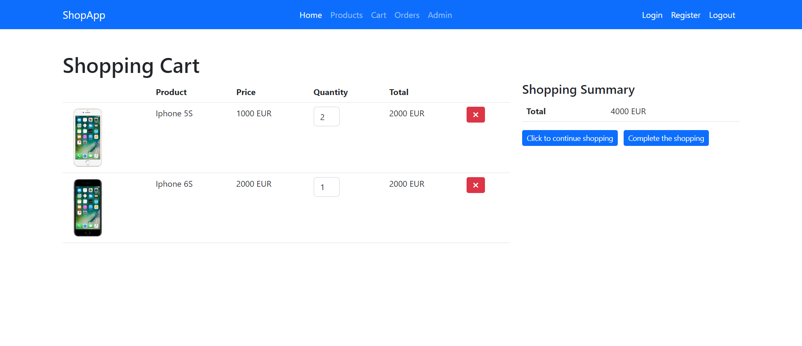

# Angular Shoping App

## Start Project
- `npm install` to install all dependencies
- `npm run json` to start the json-server
- `ng serve` to start the project
## Used Technologies
- Angular 15
- json-server
- jsonwebtoken
- jwt
- Http Methods
- Bootstrap 5
- Font Awesome

## Screenshots

